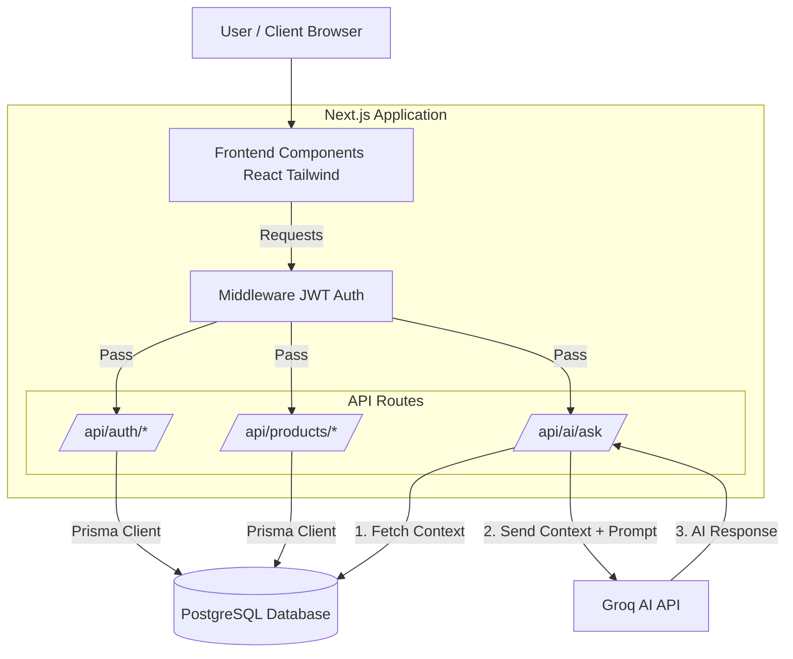

# fgdf

```mermaid
graph TD
    User[User / Client Browser]
    
    subgraph "Next.js Application"
        UI[Frontend Components React Tailwind]
        AuthMW[Middleware JWT Auth]
        
        subgraph "API Routes"
            AuthAPI[/api/auth/*/]
            ProdAPI[/api/products/*/]
            AiAPI[/api/ai/ask/]
        end
    end
    
    DB[(PostgreSQL Database)]
    Groq[Groq AI API]

    User --> UI
    UI -->|Requests| AuthMW
    AuthMW -->|Pass| AuthAPI
    AuthMW -->|Pass| ProdAPI
    AuthMW -->|Pass| AiAPI
    
    AuthAPI -->|Prisma Client| DB
    ProdAPI -->|Prisma Client| DB
    
    AiAPI -->|1. Fetch Context| DB
    AiAPI -->|2. Send Context + Prompt| Groq
    Groq -->|3. AI Response| AiAPI
```
